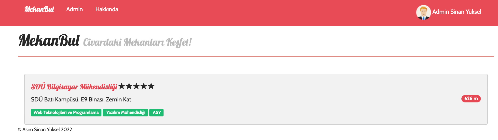
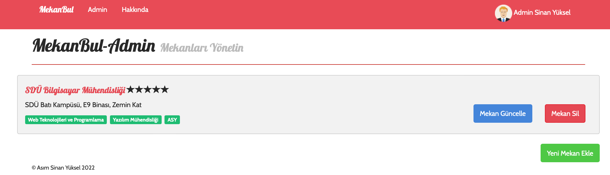
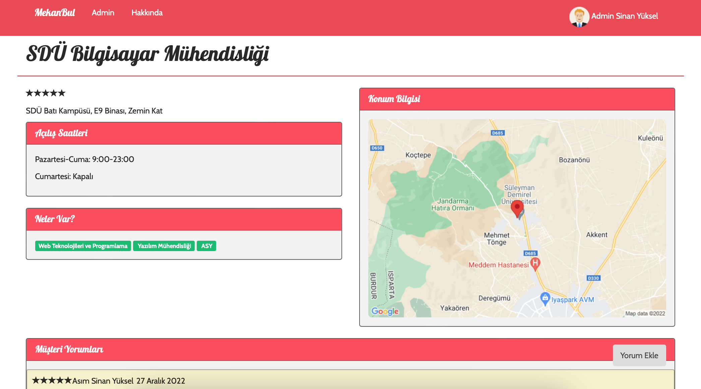

# Mekanbul Uygulaması
Mekanbul insanların konumları civarındaki mekanları, sunduğu imkanları görmelerini, mekanlara yorum yapabilmelerini sağlayan bir web uygulamadır. Uygulamanın aynı zamanda bir admin paneli mevcuttur. Admin mekan ekleme, silme, güncelleme, tüm mekanları görme gibi işlemleri yapabilmektedir.

# Uygulama Özellikleri
* **Normal Kullanıcı:** Konuma göre mekan listeleme, mekan detaylarını görebilme
* **Kayıtlı Kullanıcı:** Mekana yorum yapabilme, profil görüntüleme, profil güncelleme, şifre yenileme
* **Admin:** Tüm mekanları listeleme, mekan ekleme, mekan silme, mekan güncelleme
* **Varsayılan Rol:** Kullanıcı. Kullanıcılar koleksiyonuna giderek kayıt olduğunuz kullanıcıyı bulup rolünü "admin olarak değiştirerek admin özelliklerine erişebilirsiniz.

# API Metotları
Tüm koleksiyon API Koleksiyonu.json dosyasında yer almaktadır. Thunder Client aracılığı ile import edilebilir. 
* **Mekan Ekleme:** POST "/api/mekanlar". Mekan bilgileri girilmeli. Mekan Bilgileri: ad,adres, imkanlar, enlem, boylam, gunler1, acilis1, kapanis1, kapali1, gunler2, acilis2, kapanis2, kapali2.
* **Konuma Göre Mekan Listeleme:** GET "/api/mekanlar?enlem=37&boylam=35". Enlem ve boylam sorgu parametresi olarak verilmeli.
* **Tüm Mekanları Listeleme:** GET "/api/admin". Auth.Bearer Token Girilmeli.
* **Mekan Getir:** GET "/api/mekanlar/:mekanid".
* **Mekan Güncelle:** PUT "/api/mekanlar/:mekanid". Auth.Bearer Token Girilmeli. Mekan bilgileri girilmeli. Mekan Bilgileri: ad,adres, imkanlar, enlem, boylam, gunler1, acilis1, kapanis1, kapali1, gunler2, acilis2, kapanis2, kapali2.
* **Mekan Sil:** DELETE "/api/mekanlar/:mekanid". Auth.Bearer Token Girilmeli.
* **Yorum Getir:** GET "/api/mekanlar/:mekanid/yorumlar/:yorumid".
* **Yorum Ekle:** POST "/api/mekanlar/:mekanid/yorumlar". Auth.Bearer Token Girilmeli. Yorum bilgileri girilmeli. Yorum Bilgileri: yorumMetni, puan
* **Yorum Güncelle:** PUT "/api/mekanlar/mekanid/yorumlar/:yorumid". Auth.Bearer Token Girilmeli. Yorum bilgileri girilmeli. Yorum Bilgileri: yorumMetni, puan
* **Yorum Sil:** DELETE "/api/mekanlar/:mekanid/yorumlar/:yorumid". Auth.Bearer Token Girilmeli
* **Giriş Yap:** POST "/api/girisyap". Auth.Bearer Token Girilmeli. Kullanıcı bilgileri girilmeli. Kullanıcı Bilgileri: eposta, sifre.
* **Kayıt Ol:** POST "/api/kayitol". Auth.Bearer Token Girilmeli. Kullanıcı bilgileri girilmeli. Kullanıcı Bilgileri: adsoyad, eposta, sifre.
* **Profil Görüntüle:** GET "/api/profil". Auth.Bearer Token Girilmeli.
* **Profil Güncelle:** PUT "/api/profilguncelle". Auth.Bearer Token Girilmeli. Kullanıcı bilgileri girilmeli. Kullanıcı Bilgileri: eposta, sifre.
* **Şifre Yenileme İsteği:** POST "/api/sifremiyenile". Eposta gerekli. 
* **Yeni Şifre Üretme** POST "/yenisifreuret/:token". Token ve yeni şifre gerekli. 

## Kullanılan Teknolojiler ve Araçlar
Uygulama front-end ve back-end olmak üzere iki kısımdan oluşmaktadır. MVC mimarisine uygun bir şekilde tasarlanmıştır.

* **Front-end:** PugJS, CSS
* **Back-end:** NodeJS, Express, Javascript
* **Veritabanı:** MongoDB
* **Veri Modelleme:** Mongoose
* **Kimlik Doğrulama, Güvenlik:** PassportJS, JWT
* **Haberleşme:** REST API, Axios
* **Test:** Mocha,Mochawesome, Chai, Supertest
* **IDE:** Visual Studio Code
* **REST API Client:** Thunder Client
* **REST API Dokumantasyon Aracı:** Swagger
* **Versiyonlama:** Git

## Kütüphanelerin Yüklenmesi

Çalıştırmadan önce gerekli kütüphanelerin yüklenmesi gerekir. Proje klasörü içindeyken terminalde aşağıdaki komutları kullanarak bu kütüphaneleri yükleyin

### `npm install`

## Uygulamanın Çalıştırılması
Aşağıdaki komut ile uygulamayı çalıştırabilirsiniz. 

### `npm start`

## REST API Testi
Aşağıdaki komut ile API testini çalıştırabilirsiniz. 

### `npm run test`

* Uygulama [http://localhost:3000](http://localhost:3000) adresinde çalışmaktadır. Anasayfaya erişmek için enlem ve boylam parametreleri verilmelidir. **Örnek:** [http://localhost:3000?enlem=37&boylam=35](http://localhost:3000?enlem=37&boylam=35)
* Swagger API Dokumantasyonuna [http://localhost:3000/apidoc](http://localhost:3000/apidoc) adresinden ulaşılabilir.
* [Replit Demo](https://mekanbul-fullstack.asimsinanyuksel.repl.co/?enlem=37.8&boylam=30.5): Admin: Eposta:admin@admin.com Şifre:1234 

# Ekran Görüntüleri

